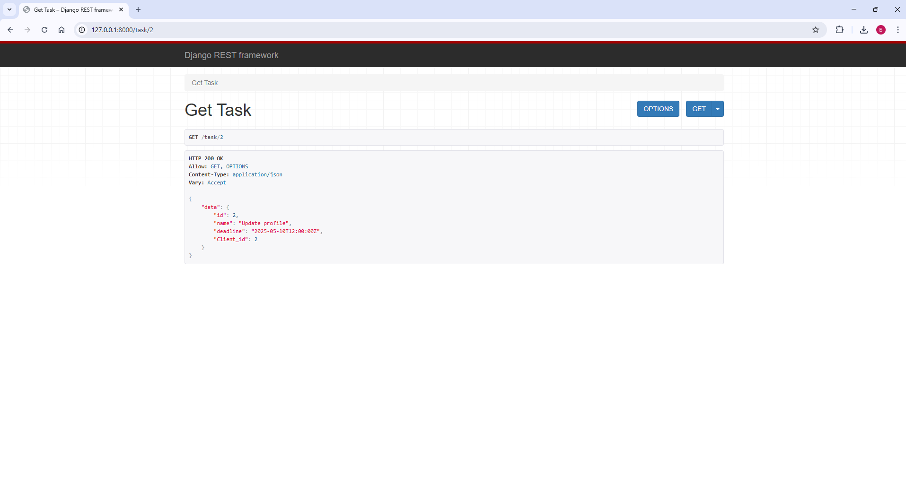
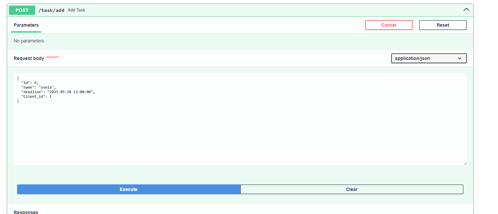
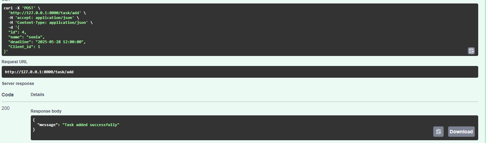
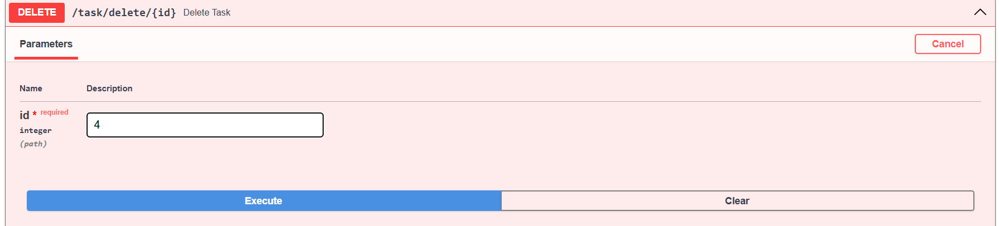
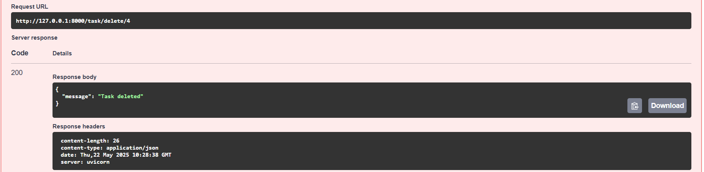
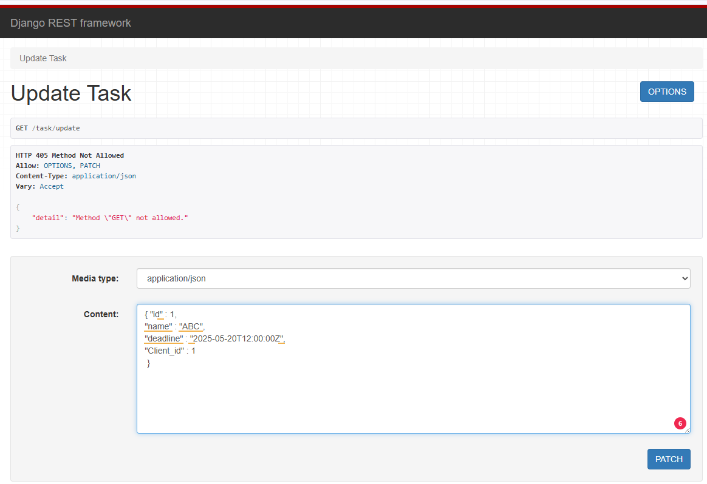
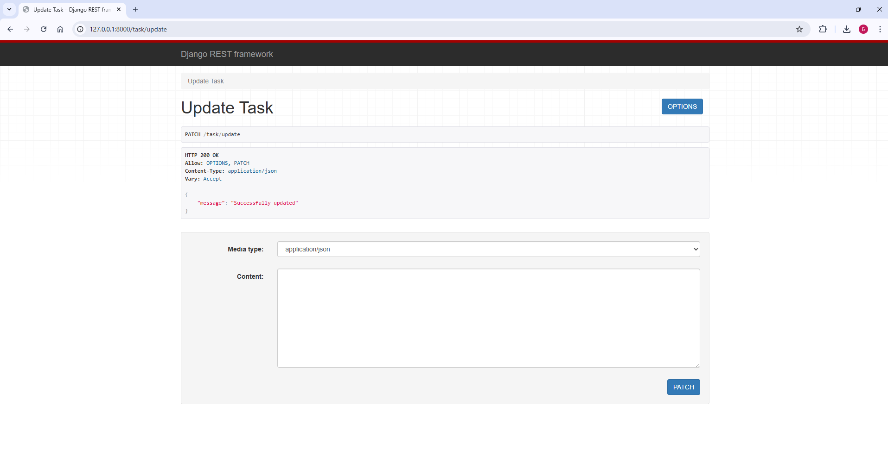
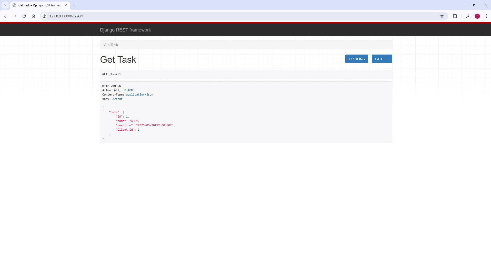

# Тестування працездатності системи

## RESTfull сервіс для управління даними
## Головна сторінка
---

  

## GET ALL - отримати всі завдання
---

  
.png)

## GET ONE - отримати одне завдання
---

  

## POST - створити завдання
---

  

---

---

## DELETE - видалити завдання
---

  

---

---
.png)

## PUT - змінити завдання
---

  

---

---

